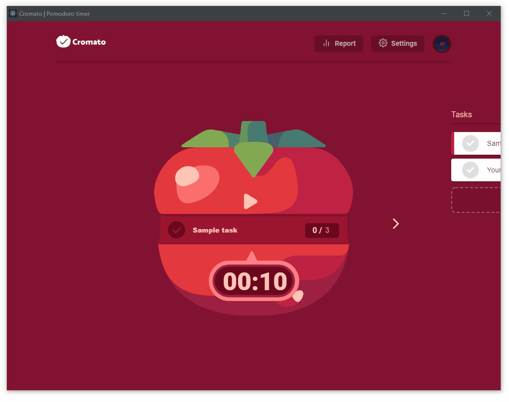

# Cromato | DA376D VT21 Project <!-- omit in toc -->
> Pomodoro timer with offline capabilities

## Overview

Powerful **pomodoro timer** with offline capabilities, local caching, real-time task synchronization, OPEN REST API, and pixel perfect animations built on top of _ReactJS_ and _NodeJS_ and deployed on _heroku_. 

## Table of Contents <!-- omit in toc -->
- [Overview](#overview)
- [Features](#features)
  - [Unlimited tasks with real-time synchronization](#unlimited-tasks-with-real-time-synchronization)
  - [Add tasks](#add-tasks)
  - [Edit tasks](#edit-tasks)
  - [Delete tasks](#delete-tasks)
  - [Keep track of finished tasks](#keep-track-of-finished-tasks)
  - [In-App settings](#in-app-settings)
  - [Statistics / Performance report](#statistics--performance-report)
- [System design](#system-design)
  - [Client](#client)
  - [Database](#database)
  - [Backend](#backend)
  - [Deployment](#deployment)
  - [Build scripts](#build-scripts)
  - [Deployment method](#deployment-method)
  - [Authentication](#authentication)
  - [Open REST API](#open-rest-api)
  - [Offline capabilities and Offline-first approach](#offline-capabilities-and-offline-first-approach)
    - [Offline-first](#offline-first)
  - [Docker Image](#docker-image)
- [Technologies used / Requirements](#technologies-used--requirements)
  - [Grade 3](#grade-3)
  - [Grade 4](#grade-4)
  - [Grade 5](#grade-5)

## Features

### Unlimited tasks with real-time synchronization

**Add, edit and delete tasks** freely with ease of use - every task is sync'ed across multiple devices in real time thanks to the adoption of a noSQL realtime database powered by the _Google Cloud infrastructure_

### Add tasks

Add **tasks** through the expanded task list, available expanding the right drawer, or directly through the task editor

### Edit tasks 

Edit your task's name, completion,  estimated pomodoro and let the _Cromato_ automatically update it and sync it across every device

### Delete tasks

If you accidentally added a task, or simply changed your mind you can always delete it!

### Keep track of finished tasks

Regardless of the elapsed pomodoro, you can always check the task you have completed and keep track of your progresses!

### In-App settings

Adjust application's and timer specific settings such as _pomodoro durations_, _auto-closing drawer_, _editor auto-focus_ and _offline mode_

### Statistics / Performance report

Check you performance in realtime, and generate report to evaluate your efficiency 

## System design

The system has been designed around a NodeJS server that:
1. serve the `cromato-client-reactjs`
2. provide `Open REST API` for statistical purposes for 3rd party applications

### Client

The client is a single page PWA web app built on top of _ReactJS_ served by the _NodeJS_ server and deployed over _Heroku_.

### Database

The application uses the noSQL _Google Firebase real time database_ in conjuction with _firestore_ to secure, store and retrieve all the tasks and associated information. The database has been deployed and managed with the [Google Cloud Console](https://console.cloud.google.com/).

> db access rules restrictions: only the owner of the data can read/write

### Backend

The server has been implemented in _NodeJS_ using _express_ with the following notable deps:
1. `firebase-admin-sdk`
2. `passport`
3. `passport-google-oath20`
4. `cookie-session`
5. `dotenv`
6. `cors`

### Deployment

The database holding the application data as well as settings and statistics (partials) has been deployed on _Firebase/Google Cloud Platform_. The NodeJS backend and the React PWA have been deployed on _Heroku_.

### Build scripts

When deployed, the backend is first build, then the `cromato-client-reactjs` is built using _Heroku_ postbuilt. 
> `heroku-postbuild": "cd cromato-client-reactjs && npm install --only=dev && npm install && npm run build`

### Deployment method

Both the backend and client are automatically deployed on `Heroku` once a commit or PR is pushed on the branch `master`. 

### Authentication

Both the _React PWA client_ and the _Open REST API_ are secured using **Google's OAuth2.0** with registered Google API Key credential. 

### Open REST API

The _OPEN REST API_ provides all the statistics available in the _PWA client_ and more (e.g. overdues tasks) along with all the tasks and their details as well as a basic user profiling. All the endpoints required the user to auth using **Google's Oauth2.0** and provide information only regarding the auth user. An extra layer of protection has ben added in the DB access rules, allowing the auth user only to read/write his data.

| Exposed endpoint path  | description |  response type |
| ------------- | ------------- | ------------- | 
| `/api`        | Main entry-point |  `REDIRECT` |
| `/api/auth`  | Auth using Google's OAuth2.0  |  `REDIRECT` |
| `/api/auth/callback`  | Callback from OAuth2.0 |  `REDIRECT` |
| `/api/statistics`  | Provide statistics  |   `JSON` |
| `/api/fail`  | onAuth failed |    `JSON` |
| `/api/signout`  | Signout and destroy server's session  |    `JSON` |
| `/api/loggedout`  | onSignOut  |   `JSON` |

### Offline capabilities and Offline-first approach

The React PWA client offers pre-enabled offline support with additional `opt-in offline-first` implementation. The client automatically detects network throttling and/or interruptions and when necessary cache data locally allowing the user to use the application even in cases of service disruption.
> You can add/remove/edit tasks while offline and push them as soon as you go online

#### Offline-first

Optionally is possible to enable the `offline-mode` in the settings modal. This will force the client to cache data locally and will interrupt any communication and/or subscription handle with the server. 

### Docker Image

The NodeJS server has been dockerized per-specification and a `.dockerignore` has also been created. 

## Technologies used / Requirements

### Grade 3

- [x]  Version control: GitHub | `🏷️req 3.1`
- [x] NodeJS backend | `🏷️req 3.2`
- [x] Front-end: ReactJS | `🏷️req 3.3`
- [x] Persistent storage: Firebase `🏷️req 3.4`
- [x] Purpose: time management | `🏷️req 3.5`
- [x] Documentation: availble on readme file |`🏷️req 3.6`
- [x] User can auth (wigh google OAuth 2.0) to store his _tasks_ or (todos) | `🏷️req 3.7`
- [x] the NodeJS will provide a REST API that serves all the data (todos / user-info etc) `🏷️req 3.8`

### Grade 4

- [x] Data collection: add tasks (todos)
   - [x] statistics function:  productivity performances (tasks  created/completed, pomodoro run etc...) | `🏷️req 4.9`
- [x]  Separate view to display productivity performance (display statistics) | `🏷️req 4.10`
- [x]  NodeJS _OPEN REST API_ that provides statistics | `🏷️req 4.11`
- [x]  " Distinctive Cloud Technology ": Serverless functions |  `🏷️req 4.12`

### Grade 5

- [x]  Create a deployable docker image |  `🏷️req 5.13`
- [x]  either:  `🏷️req 4.14`
   - [x]  deploy with GH Actions
   - [x]  build with GH Actions
- [x]  React Offline capabilities |  `🏷️req 4.15`
   - [x]  You can add/remove/edit tasks (todos) while offline and push them as soon as you go online
- [x]  OPEN REST API (statistics) must verify the user identity before serving the request |  `🏷️req 4.16`
- [x]  In-depth documentation on readme with technical explanation |  `🏷️req 4.17`